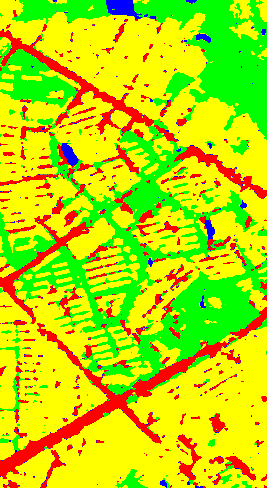

# Satellite Image Segmentation with Light U-Net

A TensorFlow implementation of a lightweight U-Net style semantic segmentation framework for satellite and remote sensing imagery.

This project focuses on pixel-wise segmentation of aerial images and demonstrates a practical deep learning workflow for remote sensing image analysis.

## Overview

Semantic segmentation is an important task in remote sensing, where each pixel in an image is assigned to a semantic class such as **road**, **building**, **water**, or **background**.

This repository implements a **Light U-Net** framework for satellite image segmentation using **TensorFlow 1.x**. The architecture combines efficient encoder-decoder design with residual-style blocks and pyramid-style upsampling to produce detailed segmentation masks.

The original framework was used in the **2017 CCF BDCI Remote Sensing Image Semantic Segmentation Challenge** and reportedly achieved **0.891 accuracy**.

## Key Features

- Lightweight U-Net style segmentation framework
- Designed for remote sensing and satellite image analysis
- TensorFlow-based training and inference pipeline
- Residual-style convolution blocks
- Pyramid-like upsampling structure
- Example qualitative results included

## Preview

<p align="center">
  
  
</p>

## Environment

This project was originally developed with the following environment:

- Ubuntu 16.04
- Python 2.7
- TensorFlow 1.3
- OpenCV 3.2
- CUDA 8.0

> This is a legacy TensorFlow 1.x implementation. A compatible NVIDIA GPU environment is recommended for training and testing.

## Repository Structure

```text
.
├── Network.py                 # network architecture
├── dataset-processing.py      # dataset preparation and preprocessing
├── train.py                   # model training
├── test-model.py              # inference / testing
├── utils.py                   # helper functions
├── sample_visible.png         # example input image
├── sample_result.png          # example segmentation output
├── LICENSE
└── README.md´´´´
